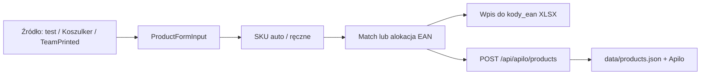

# Plan: Import katalogu Incore (EYR damskie + Koszulker + TeamPrinted)

**Date:** 2026-07-16  
**Status:** done (2026-07-16)  
**App:** http://localhost:3000 (`npm run dev`)

---

## Cel

Dowieźć trzy niezależne, ale podobne przepływy: produkt w Apilo + wiersze GTIN/SKU w `kody_ean/ean_koszulki_warianty_uzupelnione.xlsx`.

| # | Zadanie | Stan wyjściowy |
|---|---------|----------------|
| 1 | Earn Your Reps **damskie** | Męskie w Apilo; damskie GTIN XS–XL już w XLSX (bez SKU) |
| 2 | Produkty z **Koszulker** | Scraper + UI `/products/import` istnieją |
| 3 | Katalog **[TeamPrinted Incore Sports Store](https://teamprinted.pl/s/incore-sports-store/)** (~12 produktów) | Brak scrapera — do zbudowania |

---

## Wspólny przepływ per produkt

Zasady:
- SKU damskie koszulki czarne: `TDCS-…` (T=t-shirt, D=damska, C=czarny), męskie: `TMCS-…`
- Kategoria męska: `[25, 43, 49]` — Odzież / Dla niego / Koszulki męskie
- Kategoria damska: ustalić z API Apilo (obecnie w Koszulker mapowaniu jest placeholder)
- EAN: match z GS1 po nazwie+rozmiarze; nowe kody z poola (`EAN_POOL_START` / max+1)
- Po imporcie: uzupełnić kolumnę `Symbol wewnętrzny` w XLSX (SKU ↔ GTIN)

---

## U1. Earn Your Reps damskie

**Cel:** Ten sam produkt co męski `TEST_PRODUCT`, wariant damski, w Apilo + SKU w katalogu EAN.

**Dane GS1 (już w XLSX):**

| Rozmiar | GTIN |
|---------|------|
| XS | 5906058689592 |
| S | 5906058689608 |
| M | 5906058689615 |
| L | 5906058689622 |
| XL | 5906058689639 |

**Podejście:**
1. Dodać `TEST_PRODUCT_WOMEN` (nazwa z „damska”, kategoria damska, warianty XS–XL, SKU `TDCS-EYR-IS-{SIZE}`, EAN z tabeli).
2. Przycisk w ProductWizard: „Wczytaj EYR damskie”.
3. Uzupełnić `Symbol wewnętrzny` w XLSX dla wierszy damskich (i opcjonalnie męskich).
4. Import przez kreator (dry-run → real) albo skrypt testowy z `APILO_ALLOW_WRITE_TESTS`.
5. Naprawić `sku.ts`, żeby rozpoznawał `damska`/`męska` (obecnie tylko `damski`/`męski`).

**Poza zakresem U1:** rozmiary 2XL/3XL damskie (brak GTIN w katalogu).

---

## U2. Import z Koszulker

**Cel:** Wszystkie (lub wybrane) produkty z `incoresports.koszulker.pl` → Apilo + EAN.

**Podejście:**
1. Lista przez istniejące API `/api/scrape/koszulker?action=list`.
2. Batch → ProductWizard / import panel.
3. Dla każdego: SKU, alokacja EAN (portable export), dopisanie do XLSX, POST do Apilo.
4. Ustawić poprawne `categoryIds` dla płci damskiej (zależność od U1 / discovery kategorii).
5. Zdjęcia: upload S3 jeśli skonfigurowany, inaczej URL ze źródła.

**Ryzyko:** duplikaty względem EYR już w Apilo — pomijać po SKU/nazwie.

---

## U3. Scraper + import TeamPrinted Incore Store

**Cel:** Zescrapować [incore-sports-store](https://teamprinted.pl/s/incore-sports-store/) i dodać produkty do Apilo + EAN.

**Produkty ze storefrontu (ok. 12):** bluzy rozpinane, koszulki (Bahrain, crop top, spódniczka Serena), legginsy, biustonosze, ręcznik, torba itd.

**Podejście:**
1. Nowy moduł `src/lib/scrape/teamprinted/` (parser listing + detail) — wzorowany na Koszulker.
2. API route + panel UI (lub rozszerzenie importu).
3. Mapowanie → `ProductFormInput` + `generateSkus`.
4. EAN z poola + wiersze w XLSX.
5. Import do Apilo jak wyżej.

**Ryzyko:** Shopify/custom theme — selektory HTML do ustalenia przy pierwszym fetchu; warianty kolor/rozmiar mogą wymagać osobnego scrape detail page.

---

## Kolejność wykonania

1. **U1** (najszybsze — dane gotowe) ← start teraz  
2. **U2** (narzędzia istnieją)  
3. **U3** (nowy scraper)

## Progress (2026-07-16)

- [x] Plan zapisany; app na http://localhost:3000
- [x] `TEST_PRODUCT_WOMEN` + przycisk „Wczytaj EYR damskie” w kreatorze
- [x] SKU w XLSX (`TMCS-…` / `TDCS-…`) dla 10 wierszy EYR
- [x] Scraper TeamPrinted (listing → form) + UI na `/products/import`
- [x] API `/api/scrape/teamprinted` zwraca 12 produktów
- [ ] **BLOKER:** Apilo OAuth — `npm run apilo:auth` → Invalid credentials (potrzebny nowy `APILO_AUTHORIZATION_CODE`)
- [ ] Import damskiego EYR do Apilo (po auth)
- [ ] Import Koszulker → Apilo + EAN (po auth)
- [ ] Import 12× TeamPrinted → Apilo + EAN (po auth); kategorie damskie do weryfikacji

## Definition of Done

- [ ] Damskie EYR w Apilo z EAN XS–XL i SKU `TDCS-EYR-IS-*`
- [x] XLSX ma `Symbol wewnętrzny` dla wierszy EYR
- [ ] Produkty Koszulker (poza duplikatami EYR) w Apilo + EAN
- [ ] Wszystkie produkty ze store TeamPrinted w Apilo + EAN
- [ ] Aplikacja działa lokalnie; importy widoczne w historii

## Założenia

- Cena/VAT/stock damskiego EYR jak męskiego (79 zł, 23%, qty 10), o ile użytkownik nie wskaże inaczej.
- TeamPrinted: hurtowe ceny ze sklepu jako baza `priceWithTax`.
- Nie rejestrujemy ręcznie nowych GTIN w MojeGS1 w tej sesji — tylko lokalny katalog + pool; rejestracja GS1 osobno.
